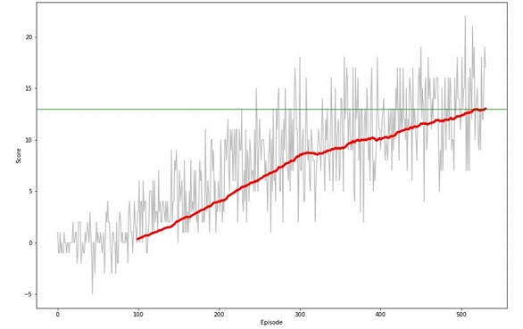

# Summary

This report documents the course project 'Navigation' where you train an agent to navigate (and collect bananas!) in a large, square world.

## Problem

A reward of +1 is provided for collecting a yellow banana, and a reward of -1 is provided for collecting a blue banana. Thus, the goal of your agent is to collect as many yellow bananas as possible while avoiding blue bananas.

The state space has 37 dimensions and contains the agent's velocity, along with ray-based perception of objects around the agent's forward direction. Given this information, the agent has to learn how to best select actions. Four discrete actions are available, corresponding to:
    0 - Forward; 
    1 - Backward; 
    2 - Left; 
    3 - Right
    
The task is episodic, and in order to solve the environment, your agent must get an average score of +13 over 100 consecutive episodes.

## Solution

Based on literature survey, an improved variant of [Deep Q-Learning(DQN)](https://storage.googleapis.com/deepmind-media/dqn/DQNNaturePaper.pdf) named [Double Q-Learning(DDQN)](https://arxiv.org/pdf/1509.06461.pdf) was selected. Double Q-learning overcomes the limitation of Q-learning algorithm to overestimate action values in certain conditions.

### Learning Algorithm

In Double Q-learning algorithm, two value functions are learned by assigning each experience randomly to update one of the two value functions, such that there are two sets of weights. For each update, one set of weights is used to determine the greedy policy and theother to determine its value.

Both the local and target Q-networks (neural networks) in the implementation are built as below:

State -- > Layer 1 (64 Units) -> Leaky ReLU --> Layer 2 (64 Units) -> LinearReLU --> Action

Experience Replay and Epsilon Greedy policy are implemented as per original Deep Q-learing paper for Sample efficiency, stability and optimal Exploration-Exploitation.

### Plot of Rewards



### Ideas for Future Work

The performance of the Navigation agent can be improved by experimenting with below ideas:
 1. Implement [Prioritized Experience Replay](https://arxiv.org/abs/1511.05952)
    (A framework for prioritizing experience, so as to replay important transitions more frequently, and therefore learn more efficiently)
 2. Implement multiple suggested improvements to DQN, i.e [Dueling DQN](https://arxiv.org/abs/1511.06581) for better policy evaluation & [Noisy DQN](https://arxiv.org/abs/1706.10295) for better exploration.


```python

```
